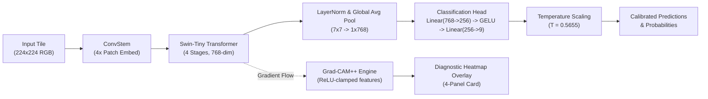
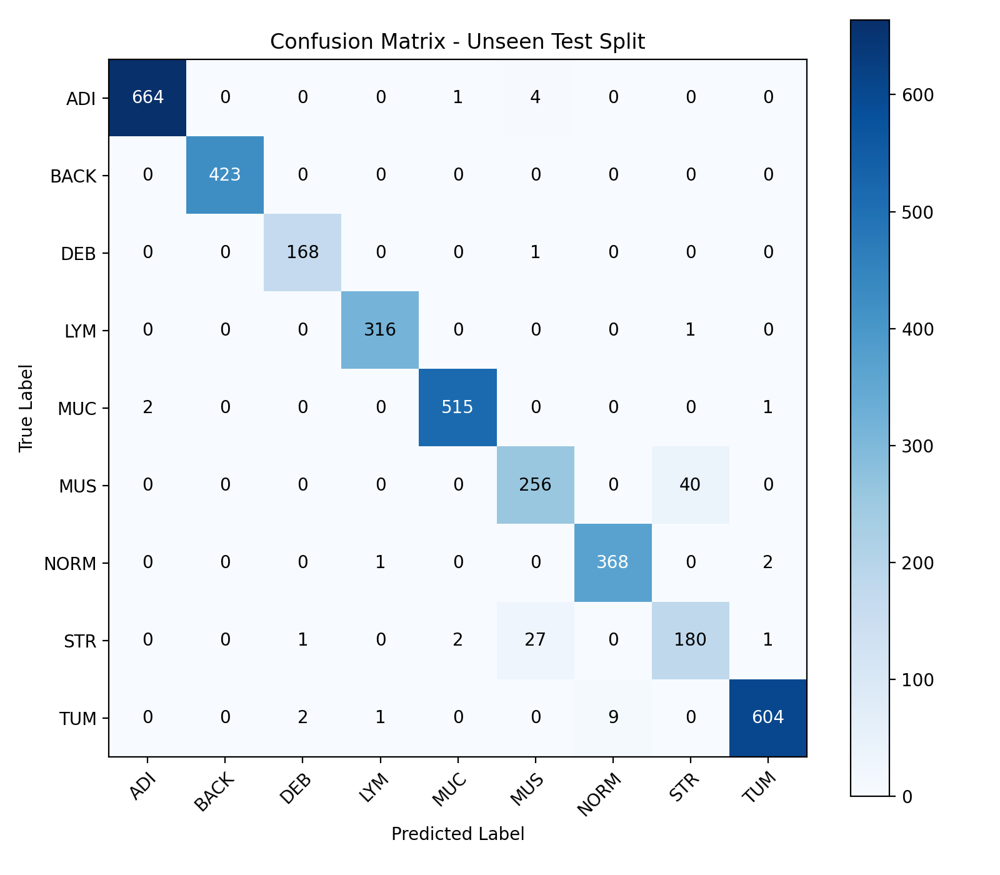

<div align="center">

# 🔬 XPathology: Colorectal Tissue Specialist
### 9-Class Colorectal Histopathology Classifier with CTransPath (Swin Transformer) & Vision-Transformer Grad-CAM++

[](https://pytorch.org/)
[](https://github.com/huggingface/pytorch-image-models)
[](https://huggingface.co/)
[](https://github.com/Muhammad-Hassan12)
[](https://github.com/Muhammad-Hassan12)
[](https://www.gnu.org/licenses/gpl-3.0)

<p align="center">
  <a href="#-key-highlights">Key Highlights</a> •
  <a href="#-histological-taxonomy">Histological Taxonomy</a> •
  <a href="#-architecture--innovations">Architecture & Innovations</a> •
  <a href="#-benchmark-comparison">Benchmarks</a> •
  <a href="#-quickstart--usage">Quickstart</a> •
  <a href="#-explainability-grad-cam">Grad-CAM++</a> •
  <a href="#-author">Author</a>
</p>

---

</div>

## ⚠️ Clinical & Educational Disclaimer

> [!IMPORTANT]
> **RESEARCH AND EDUCATIONAL USE ONLY.**  
> This model is not an FDA/CE-cleared medical device, has not been clinically validated, and **must not be used for patient diagnosis, clinical staging, or real-world treatment decisions.** It is released as an open-source contribution under the **X-Pathology** research initiative to support computational pathology benchmarking and interpretability research.

---

## 🌟 Key Highlights

* **Domain-Native Pathology Pretraining:** Built on **CTransPath** (Swin-Tiny Transformer with custom `ConvStem` patch embed), pretrained via semantically-relevant contrastive learning (SRCL) on **~15M histology patches from ~32K WSIs** (PAIP + TCGA).
* **Strict Non-Leakage Validation:** Evaluated on an independent, unseen external patient cohort (**CRC-VAL-HE-7K**, $n=3,590$) yielding **97.33% Test Accuracy** and **0.9615 Macro F1**.
* **Transformer-Adapted Grad-CAM++:** Engineered with a specialized positive feature-clamping fix to eliminate denominator collapse on signed LayerNorm Swin feature maps, featuring an automatic fallback to vanilla Grad-CAM.
* **Temperature-Calibrated Probabilities:** Optimized post-hoc calibration ($T = 0.5655$) that cuts validation Negative Log-Likelihood (NLL) by **52.2%** ($0.1960 \rightarrow 0.0937$), transforming raw softmax overconfidence into reliable diagnostic probabilities.
* **Dual Weights Available:** Includes both standard PyTorch (`.pt`) and secure zero-copy Hugging Face (`.safetensors`) checkpoints.

---

## 📊 Benchmark Comparison

Evaluated on the exact same untouched holdout test cohort (`CRC-VAL-HE-7K`, $n=3,590$):

```
+-----------------------------------------------------------------------------------------+
| Model Architecture        | Pretraining Domain         | Test Acc  | Macro F1 | Status  |
+-----------------------------------------------------------------------------------------+
| EfficientNet-B2 (v1)      | ImageNet-1k (Natural)      | 92.70%    | 0.8980   | Old     |
| CTransPath Swin-Tiny (v6) | Pathology (PAIP/TCGA ~15M) | 97.33%    | 0.9615   | Current |
+-----------------------------------------------------------------------------------------+
```

$$\Delta = \mathbf{+4.63\% \text{ Accuracy}} \quad \vert \quad \Delta = \mathbf{+0.0635 \text{ Macro F1}}$$

---

## 🧬 Histological Taxonomy (9 Classes)

| Class | Full Histological Name | Description & Clinical Relevance | Color Code |
| :--- | :--- | :--- | :--- |
| `ADI` | **Adipose Tissue** | Fat tissue / subserosal connective layer | 🟨 `#FFD700` |
| `BACK` | **Background** | Glass slide / non-tissue background | ⬜ `#A0A0A0` |
| `DEB` | **Debris & Necrosis** | Necrotic cellular debris, fragmented dead cells | 🟫 `#8B4513` |
| `LYM` | **Lymphocytes** | Immune infiltration / Tumor-Infiltrating Lymphocytes (TILs) | 🟦 `#4169E1` |
| `MUC` | **Mucus** | Mucin pools in colorectal mucosa | 🟪 `#20B2AA` |
| `MUS` | **Smooth Muscle** | Muscularis propria / muscularis mucosae | 🟥 `#FA8072` |
| `NORM` | **Normal Colon Mucosa** | Healthy, non-neoplastic colonic glands | 🟩 `#32CD32` |
| `STR` | **Cancer-Associated Stroma** | Desmoplastic stroma surrounding invasive glands | 🟧 `#FF8C00` |
| `TUM` | **Colorectal Adenocarcinoma** | Malignant epithelial tumour tissue | 🔴 `#DC143C` |

---

## 🏗️ Architecture & Engineering Innovations



### 1. `ConvStem` Patch Embedding
Standard Swin Transformers use a linear patch projection. CTransPath integrates a specialized convolutional stem with dual `Conv2d(3x3) + BatchNorm2d + ReLU` blocks followed by `Conv2d(1x1)` to capture inductive spatial biases critical for cellular morphology.

### 2. The No-Leakage Cross-Cohort Protocol
Standard random splitting of Whole Slide Image (WSI) tiles scatters adjacent tiles across splits, causing severe patient data leakage (inflating metrics to 99%+). We train exclusively on **NCT-CRC-HE-100K** ($100,000$ tiles) and benchmark strictly on an independent patient cohort **CRC-VAL-HE-7K** ($3,590$ validation / $3,590$ holdout test).

### 3. Grad-CAM++ Fix for Vision Transformers
Grad-CAM++ assumes post-ReLU non-negative activations. Because Swin features end in LayerNorm (zero-centered, signed), standard Grad-CAM++ suffers denominator collapse and produces flat, uniform heatmaps. Our implementation:
1. Computes $\alpha$-weights on positive clamped features (`feat_map.clamp(min=0.0)`).
2. Incorporates an automatic fallback guard to vanilla linear-weighted Grad-CAM if dynamic range collapses ($\max - \min < 10^{-6}$).

---

## 📈 Evaluation & Confusion Matrix

Evaluated on the independent `CRC-VAL-HE-7K` test cohort ($n=3,590$):

| Class | Precision | Recall | F1-Score | Support ($n$) |
| :--- | :--- | :--- | :--- | :--- |
| **ADI** | 0.9970 | 0.9925 | **0.9948** | 669 |
| **BACK** | 1.0000 | 1.0000 | **1.0000** | 423 |
| **DEB** | 0.9825 | 0.9941 | **0.9882** | 169 |
| **LYM** | 0.9937 | 0.9968 | **0.9953** | 317 |
| **MUC** | 0.9942 | 0.9942 | **0.9942** | 518 |
| **MUS** | 0.8889 | 0.8649 | **0.8767** | 296 |
| **NORM** | 0.9761 | 0.9919 | **0.9840** | 371 |
| **STR** | 0.8145 | 0.8531 | **0.8333** | 211 |
| **TUM** | 0.9934 | 0.9805 | **0.9869** | 616 |
| **Macro Avg** | **0.9600** | **0.9631** | **0.9615** | 3,590 |
| **Weighted Avg** | **0.9737** | **0.9733** | **0.9734** | 3,590 |

<div align="center">
  
  <p><em>Confusion Matrix on the untouched CRC-VAL-HE-7K holdout patient cohort</em></p>
</div>

---

## 📁 Repository Structure

```
├── 📓 xpathology_colon_ctranspath_v6_training.ipynb  # Complete 2-phase training notebook
├── 🐍 predict_and_gradcam.py                         # Production inference & Grad-CAM pipeline
├── 📦 xpathology_colon_ctranspath_v6.safetensors     # Safe, fast zero-copy weights (~110 MB)
├── 📦 xpathology_colon_ctranspath_v6.pt              # PyTorch checkpoint (~110 MB)
├── 🏷️ class_names.json                               # 9-class CRC taxonomy mapping
├── 🌡️ temperature_value_v6.npy                       # Calibrated temperature scalar (0.5655)
├── 📊 training_summary_v6.json                       # Hyperparameters, metrics & config
├── 📈 confusion_matrix_v6.png                        # Test split confusion matrix plot
├── 📋 requirements.txt                               # Project dependencies
├── 📁 test/                                          # Sample histology test tiles
└── 📁 gradcam_output/                                # Generated 4-panel diagnostic reports
```

---

## 🚀 Quickstart & Usage

### 1. Installation

```bash
git clone https://github.com/Muhammad-Hassan12/XPathology-Colorectal-Tissue-Specialist.git
huggingface-cli download rarfileexe/X-Pathology-Colorectal-Tissue-Classifier-CTransPath-Backbone xpathology_colon_ctranspath_v6.safetensors --local-dir .
cd XPathology-Colorectal-Tissue-Specialist
pip install -r requirements.txt
```

### 2. Single Image Diagnostic Prediction with Grad-CAM++

```bash
python predict_and_gradcam.py --image "test/Colorectal Adenocarcinoma (Tumour).jpg"
```

**Terminal Output:**
```text
=================================================================
           CTRANSPATH DIAGNOSTIC PREDICTION REPORT
=================================================================
 Predicted Class:       TUM (Colorectal Adenocarcinoma (Tumour))
 Calibrated Confidence: 95.52% (T = 0.5655)
 Raw Softmax Conf:      70.91%
-----------------------------------------------------------------
 Top-5 Ranked Probabilities:
   Rank  Class  Calibrated Conf    Raw Conf     Description
   #1    TUM     95.52%              70.91%       Colorectal Adenocarcinoma (Tumour)
   #2    DEB      1.73%               7.35%       Debris & Necrosis
   #3    STR      0.64%               4.17%       Cancer-Associated Stroma
   #4    BACK     0.58%               3.95%       Background (Glass / Non-tissue)
   #5    NORM     0.37%               3.08%       Normal Colon Mucosa
-----------------------------------------------------------------
 Output Image Saved:    gradcam_output/Colorectal Adenocarcinoma (Tumour)_gradcam.png
=================================================================
```

### 3. Batch Directory Inference

```bash
python predict_and_gradcam.py --dir test/ --output_dir gradcam_output/
```

### 4. Target a Specific Class for Localization (e.g. Stroma)

```bash
python predict_and_gradcam.py --image "test/Cancer-Associated Stroma.png" --target_class STR
```

---

## 💻 Python API Usage

```python
from predict_and_gradcam import CTransPathInferenceEngine

# 1. Initialize Engine
engine = CTransPathInferenceEngine(
    model_path="xpathology_colon_ctranspath_v6.safetensors", # or .pt
    temperature_path="temperature_value_v6.npy"
)

# 2. Get Structured Diagnostic Predictions
result = engine.predict("test/Colorectal Adenocarcinoma (Tumour).jpg")
print(f"Prediction: {result['predicted_class']} ({result['predicted_description']})")
print(f"Calibrated Confidence: {result['calibrated_confidence']*100:.2f}%")

# 3. Generate 4-Panel Publication-Quality Diagnostic Figure
fig, result = engine.render_diagnostic_figure(
    image_input="test/Colorectal Adenocarcinoma (Tumour).jpg",
    method="gradcam++",
    alpha=0.45,
    save_path="gradcam_output/diagnostic_card.png"
)
```

---

## 👨‍💻 Author

<div align="center">

<a href="https://github.com/Muhammad-Hassan12">
  
</a>

### **Muhammad Hassan**
*AI / Deep Learning Researcher & Computational Pathology Specialist*

[](https://smhassan.me)
[](https://github.com/Muhammad-Hassan12)
[](https://linkedin.com)

</div>

---

## 📜 Citations

If you use this model or code, please cite the foundational CTransPath architecture and histology dataset:

```bibtex
@article{wang2022transformer,
  title={Transformer-based unsupervised contrastive learning for histopathology image classification},
  author={Wang, Xiyue and Yang, Sen and Zhang, Jun and Wang, Minghui and Zhang, Jing and Yang, Wei and Huang, Junzhou and Han, Xiao},
  journal={Medical Image Analysis},
  volume={81},
  pages={102559},
  year={2022},
  publisher={Elsevier},
  doi={10.1016/j.media.2022.102559}
}

@article{kather2018100000,
  title={100,000 histological images of human colorectal cancer and healthy tissue},
  author={Kather, Jakob Nikolas and Halama, Niels and Marx, Alexander},
  journal={Zenodo},
  year={2018},
  doi={10.5281/zenodo.1214456}
}
```

---

## 📄 License

This project is licensed under the **GNU General Public License v3.0 (GPL-3.0)** for non-commercial research and educational use, inheriting the license of the upstream [TransPath repository](https://github.com/Xiyue-Wang/TransPath).
